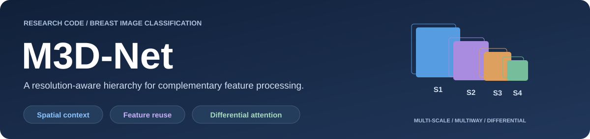
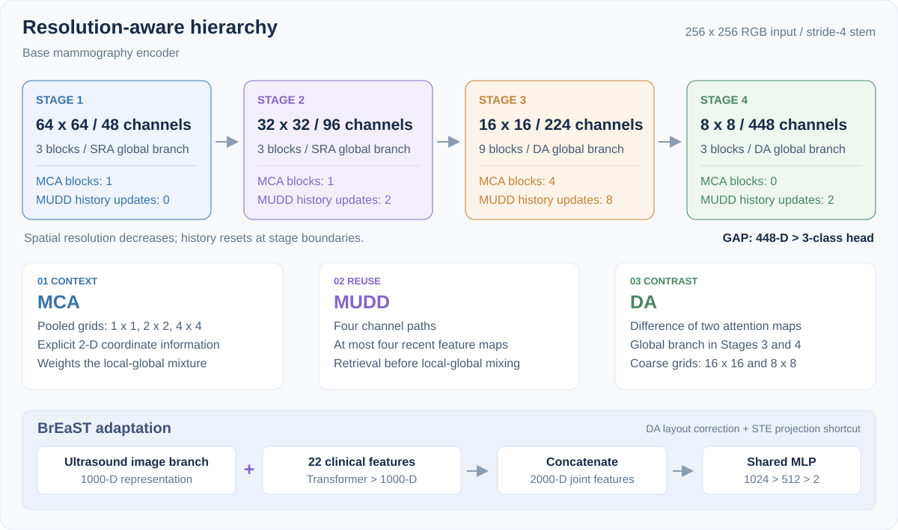

<div align="center">



### Hierarchical Coordination of Spatial Context, Feature Reuse,<br>and Differential Attention for Mammography Classification

<p><strong>Zheng Yu<sup>1</sup> · Xinhang Li<sup>2</sup> · Jiabao Gao<sup>1,2</sup> · Xiang Li<sup>3,*</sup></strong></p>

<sub>¹ Shenzhen Loop Area Institute · ² The Chinese University of Hong Kong, Shenzhen<br>³ Shenzhen Research Institute of Big Data · * Corresponding author</sub>

<br><br>

[](pixi.toml)
[](pixi.toml)
[](LICENSE)
[](configs/breast_full_clinical.json)

[**Overview**](#overview) · [**Architecture**](#architecture) · [**Quick start**](#quick-start) · [**Reproduction**](docs/reproduction.md) · [**Citation**](#citation)

</div>

---

## Overview

**M3D-Net coordinates three complementary operations across a four-stage image encoder:** coordinate-aware spatial context, bounded reuse of earlier features, and differential global attention. Resolution-aware placement preserves access to fine-scale information while reserving dense differential attention for coarse feature grids.

**M3D** stands for **multi-scale, multiway, and differential** processing of two-dimensional breast images. The manuscript studies a base mammography encoder and an adapted image–clinical ultrasound system.

This repository provides the core encoder, the adapted multimodal model, matched baseline implementations, and an executable **BrEaST 50-epoch reproduction protocol**. The original AISSLab mammography split and complete historical training configuration remain outside the released recipe. See [implementation scope](docs/implementation.md) for the distinction between the base encoder and the ultrasound adaptation.

## Architecture

<p align="center">
  
</p>

**Context — Multi-scale coordinate attention (MCA).** Pooled spatial context at multiple scales is combined with explicit two-dimensional coordinates to weight local–global features.

**Reuse — Multiway dynamic dense connections (MUDD).** Input-dependent path weights retrieve at most four recent feature maps from the current stage. History resets at resolution transitions.

**Contrast — Differential attention (DA).** Two global attention maps are subtracted in Stages 3–4, where the spatial grids are smaller. The local branch retains dynamic convolution.

The BrEaST adaptation concatenates a **1000-D image representation** with a **1000-D clinical representation**, then applies the shared `2000 → 1024 → 512 → 2` classifier. All four compared systems use the same clinical branch and fusion head.

<details>
<summary><strong>Model names and implementation variants</strong></summary>

- **`m3d` — M3D-Net†:** adapted ultrasound implementation with the DA output-layout correction and the STE projection shortcut enabled.
- **`m3d_original` — legacy encoder switches:** original DA output layout and projection behavior within the same multimodal wrapper. This option alone does not reproduce the image-only mammography experiment.
- **`edgenext` — EdgeNeXt:** XXS backbone.
- **`repvit` — RepViT:** M0.9 backbone.
- **`transxnet` — TransXNet:** T backbone.

† The two ultrasound changes alter forward computation without adding parameters. The adapted system is not a frozen mammography checkpoint. Exact tensor operations are documented in [implementation.md](docs/implementation.md).

The clinical class retains its historical name `iTransformer` for compatibility. Here it is a four-layer, eight-head Transformer encoder with a single clinical token, rather than a direct implementation of the time-series iTransformer.

</details>

## Quick start

Use a CUDA GPU with BF16 support for the reference training protocol. The locked Pixi environment covers Windows and Linux; the release was checked on Windows with an RTX 5060.

```bash
git clone https://github.com/YuZhengYYDS/M3D-Net.git
cd M3D-Net
pixi install --locked

# Check the environment and model interfaces with synthetic inputs.
pixi run test
pixi run smoke-cuda

# Download data and official ImageNet initialization weights.
pixi run download-breast
pixi run prepare-breast
pixi run weights

# Train all four matched systems, each for 50 epochs.
pixi run reproduce
```

Cloning a private repository requires access to it. Prefer Conda? Use [`environment.yml`](environment.yml); installation steps, local-archive preparation, and execution options are in the [reproduction guide](docs/reproduction.md).

### Train one model

```bash
pixi run python train.py --model m3d --output outputs/breast_full_clinical/m3d
```

### Resume a run

```bash
pixi run python train.py --model m3d --output outputs/breast_full_clinical/m3d --resume
```

### Evaluate the fixed final checkpoint

```bash
pixi run python evaluate.py --checkpoint outputs/breast_full_clinical/m3d/model.pt --split val --output outputs/breast_full_clinical/m3d/validation.json
```

Test evaluation is a separate command using `--split test`. The trainer uses only training and validation images. See [evaluation and checkpoint handling](docs/reproduction.md#resume-and-evaluation).

## Data and protocol

The released recipe uses [BrEaST / TCIA Breast-Lesions-USG](https://www.cancerimagingarchive.net/collection/breast-lesions-usg/), pairing one ultrasound image with clinical information for each of **256 patients**.

- **Partition:** 153 training / 51 validation / 52 test patients; fixed seed 42, stratified and patient-disjoint.
- **Inputs:** complete 256 × 256 ultrasound frames and 22 clinical encodings. No annotation-derived cropping; BI-RADS risk category and diagnostic labels are excluded from predictors.
- **Training:** 50 epochs, batch size 4, AdamW at `2e-5`, BF16 training and FP32 validation, with identical settings across the four systems.
- **Initialization:** verified official ImageNet weights; M3D loads only compatible TransXNet tensors. All parameters remain trainable.
- **Reporting:** fixed final-epoch accuracy; Tail averages the final ten validation accuracies. Validation and test remain separate evaluation splits.

The [shared configuration](configs/breast_full_clinical.json), [feature schema](docs/data.md), and [full reproduction guide](docs/reproduction.md) specify preprocessing, repetition, gradient clipping, loss averaging, and the original learning-rate update order.

**Source-only release.** Dataset records, checkpoints, training logs, performance tables, and result plots are not stored in this repository. The figures above are architecture schematics. Downloads and generated outputs remain in ignored local directories.

## Code map

```text
M3D-Net/
├── m3d/
│   ├── models/m3d_net.py      # Base encoder: MCA, MUDD, DA
│   ├── models/               # EdgeNeXt, RepViT, TransXNet
│   ├── clinical.py           # Clinical Transformer encoder
│   ├── fusion.py             # Shared image–clinical classifier
│   ├── data.py               # Patient partitions and augmentation
│   ├── metadata.py           # Fixed feature vocabulary
│   ├── engine.py             # Optimization and evaluation
│   └── pretrained.py         # Verified warm-start loading
├── configs/                  # Matched 50-epoch protocol
├── docs/                     # Reproduction and method details
├── tests/                    # Synthetic and protocol checks
├── assets/                   # Editable SVG architecture graphics
├── prepare_data.py           # BrEaST preparation
├── download.py               # Data and weight downloads
├── train.py                  # Training and exact-state resume
├── evaluate.py               # Fixed-checkpoint evaluation
├── reproduce.py              # Four-model experiment entry point
├── pixi.toml / pixi.lock      # Locked environment
├── environment.yml           # Conda alternative
└── LICENSE                   # Apache License 2.0
```

## Citation

To Be Announced.

## License and acknowledgments

Project-authored code and documentation are licensed under the **[Apache License 2.0](LICENSE)**. Third-party components retain their original terms: TransXNet and RepViT use Apache-2.0; EdgeNeXt components retain MIT notices. See [`NOTICE`](NOTICE) and [third-party attribution](THIRD_PARTY_NOTICES.md).

We thank the authors of [TransXNet](https://github.com/LMMMEng/TransXNet), [EdgeNeXt](https://github.com/mmaaz60/EdgeNeXt), [RepViT](https://github.com/THU-MIG/RepViT), and [BrEaST](https://github.com/best-ippt-pan-pl/BrEaST). The manuscript also builds on coordinate attention, MUDDFormer, and differential-attention research. Dataset and pretrained-weight terms are separate from the repository license.

For questions and reproducible bug reports, please use [GitHub Issues](https://github.com/YuZhengYYDS/M3D-Net/issues). See [CONTRIBUTING.md](CONTRIBUTING.md) for a short checklist.
